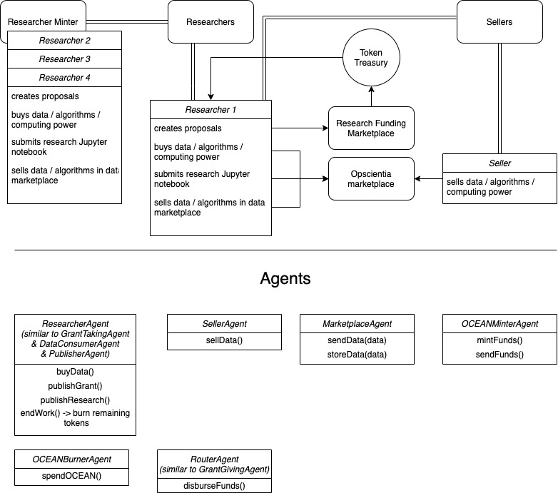

# Open Science Token Ecosystem
This simulation is testing the longevity of a decentralized open science ecosystem where researchers receive grants, buy data, and publish papers.



Note: throughout this project, the term *asset* is used solely within the context of the Opscientia marketplace, hence it encompasses data, algorithms, computing power, storage, and research papers.

### KPIs

The key metrics measured in this simulation are: 
- number of assets in the marketplace
- number of sellers (corresponding to the number of researchers who have finished their work and continue to be compensated for it)
- amount of OCEAN
- price of OCEAN
- monthly revenue of sellers

### Description of one step in the loop

1. ```ResearcherAgent``` publishes a grant proposal (fixed price)
2. ```OCEANMinterAgent``` mints fixed amount of OCEAN and sends one part to ```RouterAgent``` (the amount for grant) and sells the rest to ```OCEANBurnerAgent```
3. ```OCEANBurnerAgent``` spends everything in its wallet
4. ```RouterAgent``` sends all OCEAN in wallet to ```ResearcherAgent```
5. ```ResearcherAgent``` sends fixed amount of OCEAN to ```MarketplaceAgent``` and the rest is burned (work done)
6. ```MarketplaceAgent``` sends all OCEAN evenly to all instances of ```SellerAgent```
7. ```ResearcherAgent``` "publishes" *assets* to ```MarketplaceAgent``` (corresponding to ```assets += 1```)
8. New ```SellerAgent``` is created (corresponding to a researcher selling *assets* from research)

The diagram above shows a researcher minter, however, it will be easier if we only create a new ```SellerAgent``` rather than destroy the existing ```ResearcherAgent```, then create a new ```SellerAgent```, and then a new ```ResearcherAgent```.

### Limitations of this model

Since this is a naive implementation of the open science token ecosystem, it is bound to be restricted in its precise representation of true open science market behavior. Here is a short list of the identified limitations:
- fixed number of researchers, grant size, project length, and asset output size (not reflecting the real-world variability of research projects, which usually have teams of multiple people actively working for long periods of time)
- fixed price for marketplace assets (clearly, different services will have different prices, datasets may vary in size, algorithms may vary in the price for their utility)
- even distribution of funds to asset sellers (this will result in a gradual decrease in revenue/seller (since the money flowing through the marketplace is constant), which is on one hand slightly representative of the scenario where more people are selling their assets, thus increasing the competition and supply, hence lowering revenue, but on the other, it fails to represent the variability of different assets offered)